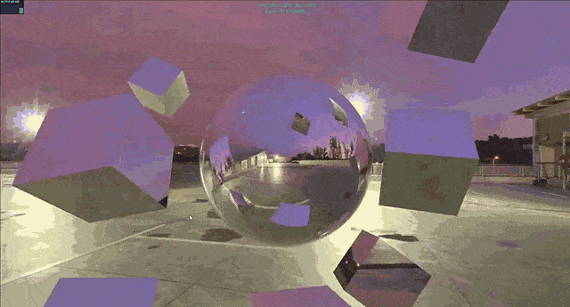

# Realistic reflection💥

> Realistic reflection of flying cubes and a sphere ❤️‍🔥

### See the <a href='https://dnt-knw.github.io/Realistic-reflection' target='_blank' title='Click to open the project'>Demo</a> 👁

## Where to start ❓

- 📜 Select background resolution (4K / 8K)
- 📜 Select a background yourself or using the "random background" button
- 📜 If you have problems with 8K, then try 4K, it has way better performance

## What you can see ❓

- A sphere that reflects the background 🔵
- 8 flying cubes that also reflect the background 🧊
- 15 different cool 4K / 8K HDRIs that you can use as a background 📷
- Author, HDRI name and its resolution at the top of the canvas 👀

## Usage ⌨️

- Hold down left mouse button 🖱 to rotate these shapes on PC 🖥 / Laptop 💻
- Use mouse wheel 🖱 to change distance to these shapes on PC 🖥 / Laptop 💻
- Use 1 finger 👆 to rotate these shapes on mobile 📱
- Use 2 fingers ✌️ to bring closer / move away from these shapes on mobile 📱
